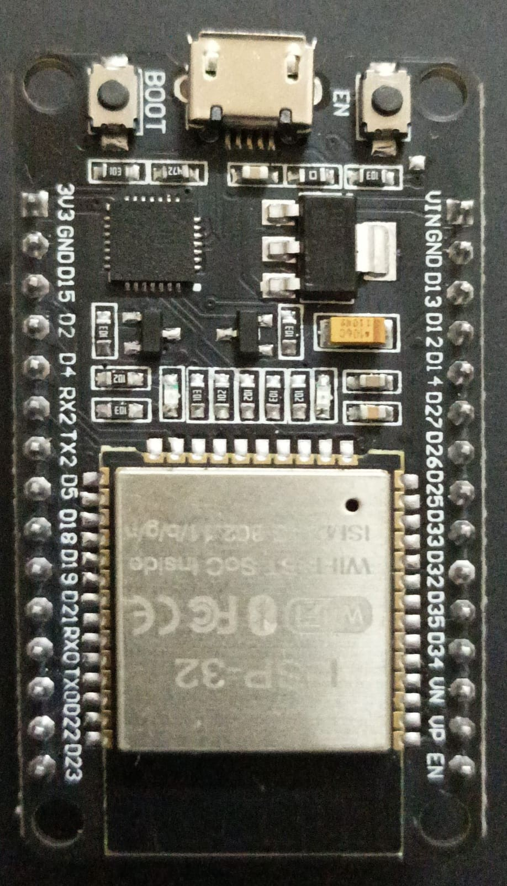
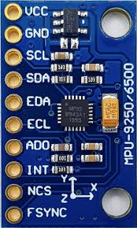
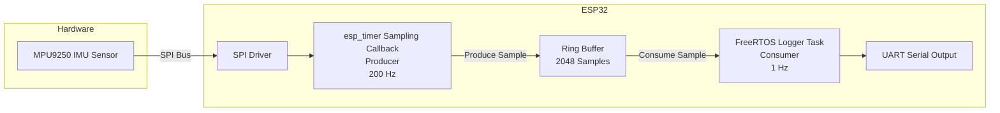

# ESP32 IMU FIFO Data Acquisition using MPU9250 (SPI)

This project implements IMU data acquisition on the ESP32 using the MPU-9250 sensor over SPI.
The firmware reads accelerometer, gyroscope, and temperature data from the sensor at 200 Hz, stores the samples in a ring buffer, and periodically logs scaled physical values over UART.

### The project demonstrates:

- SPI communication with a MEMS IMU
- Real-time sensor sampling using esp_timer
- Efficient data buffering using a lock-free ring buffer
- Conversion of raw sensor readings to physical units

### Hardware components

<table align="center">
<tr>
<td align="center" style="padding-right:40px;">
<br>
ESP32 DevKitV1
</td>

<td align="center">
<br>
MPU9250 Sensor Module
</td>
</tr>
</table>

- ESP32 Development Board
- MPU-9250 9-axis IMU sensor module
- Jumper wires
<br>

### SPI Connections

| ESP32 Pin | MPU9250 Pin |
|----------|-------------|
| GPIO23 | MOSI |
| GPIO19 | MISO |
| GPIO18 | SCLK |
| GPIO5  | CS |
| 3.3V   | VCC |
| GND    | GND |
<br>

#### SPI frequency used: 1 MHz

<br>

### Ring Buffer Architecture

The system uses a circular ring buffer to temporarily store IMU samples before processing.

Buffer Size: 
RING_BUF_LEN = 2048 samples

At 200 Hz sampling rate, this corresponds to:
2048 / 200 ≈ 10 seconds of data

Sample Structure

Each IMU sample contains:
```
Accelerometer (X,Y,Z)
Gyroscope (X,Y,Z)
Temperature
Timestamp (microseconds)
typedef struct {
    int16_t ax, ay, az;
    int16_t gx, gy, gz;
    int16_t temp_raw;
    int64_t timestamp_us;
} imu_sample_t;
Head and Tail Pointers
```
The ring buffer maintains two indices:
```
head → newest sample
tail → oldest sample
```
When the buffer becomes full, the oldest sample is overwritten and an overrun counter is incremented.

#### Power-of-Two Optimization

The buffer size is chosen as 2048 (2¹¹) to enable efficient wrap-around using bit masking:

index & (RING_BUF_LEN - 1)

This avoids slower modulo operations.

<br>

### Sensor Configuration

The MPU-9250 is initialized with the following configuration:

| Parameter | Value |
|----------|-------|
| Clock Source | PLL |
| Sample Rate | 200 Hz |
| Gyro Range | ±500 °/s |
| Accel Range | ±4 g |
| Gyro DLPF | 184 Hz |
| Accel DLPF | 218 Hz |

### Sample rate calculation:

ODR = 1000 Hz / (1 + SMPLRT_DIV)
ODR = 1000 / (1 + 4) = 200 Hz
<br>
Data Acquisition: Every 5 ms (200 Hz) the firmware reads 14 bytes starting from register ACCEL_XOUT_H.

### Data Layout

| Bytes | Data |
|------|------|
| 0–1 | Accel X |
| 2–3 | Accel Y |
| 4–5 | Accel Z |
| 6–7 | Temperature |
| 8–9 | Gyro X |
| 10–11 | Gyro Y |
| 12–13 | Gyro Z |

All values are 16-bit signed integers (big-endian).

Sensor Scaling: Raw data is converted to physical units using the MPU-9250 sensitivity constants.

<br>

From the MPU-9250 datasheet:
<br> 
### Accelerometer
±4g range

Sensitivity = 8192 LSB/g

accel_g = raw / 8192

<br> 

### Gyroscope
±500 °/s range

Sensitivity = 65.5 LSB/(°/s)

gyro_dps = raw / 65.5

<br>

### Temperature 

Temp(°C) = (raw / 333.87) + 21

Reading 14 bytes(IMU + temp) instead of 12 is convenient because the IMU registers are contiguous

<br>

### Thread / Task Design

The system follows a producer-consumer architecture to separate time-critical sensor sampling from slower UART logging operations.

#### Producer-Consumer Model

The producer collects IMU samples at 200 Hz and pushes them into a ring buffer, while the consumer reads the latest sample at 1 Hz and logs it over UART. The ring buffer decouples high-frequency data acquisition from slower logging operations, ensuring deterministic sensor sampling.


The system is divided into two concurrent execution contexts connected through a ring buffer.

| Component       | Role              | Frequency   |
|----------------|-------------------|-------------|
| Sampling Timer | Producer          | 200 Hz      |
| Ring Buffer    | Shared Data Layer | Continuous  |
| Logger Task    | Consumer          | 1 Hz        |
<br> 

#### The project uses **PlatformIO in VSCode with ESP-IDF**.

### Build

Compile the project:

```
pio run
```


### Upload Firmware

Flash the program to the ESP32:

```
pio run --target upload
```


### View Live IMU Data

Open the serial monitor:

```
pio device monitor
```


### Log Data to CSV

Save the IMU data directly to a file:

```
pio device monitor --raw > imu_log.csv
```

Stop logging with:

```
CTRL + C
```


### Reference Documents

ESP32 Datasheet

MPU9250 Datasheet

MPU9250 Register Map
