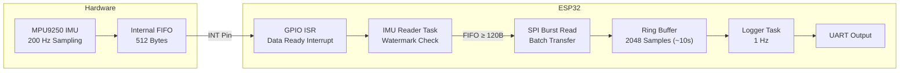

# ESP32 IMU FIFO Data Acquisition using MPU9250 (SPI)

This project implements real-time IMU data acquisition on the ESP32 using the MPU-9250 sensor over SPI.
The system samples accelerometer and gyroscope data at 200 Hz using the MPU-9250 Data Ready interrupt. Sensor measurements are buffered in the MPU FIFO and transferred to the ESP32, where they are stored in a ring buffer.

A separate FreeRTOS task periodically logs scaled physical values over UART.

### The project demonstrates:

- SPI communication with a MEMS IMU
- Interrupt-driven sensor sampling
- Use of the MPU-9250 FIFO buffer
- Efficient lock-free ring buffer design
- Real-time producer–consumer architecture
- Conversion of raw sensor readings to physical units

### Hardware components

<table align="center">
<tr>
<td align="center" style="padding-right:40px;">
<br>
ESP32 DevKitV1
</td>

<td align="center">
<br>
MPU9250 Sensor Module
</td>
</tr>
</table>

- ESP32 Development Board
- MPU-9250 9-axis IMU sensor module
- Jumper wires
<br>

### SPI Connections

| ESP32 Pin | MPU9250 Pin |
| --------- | ----------- |
| GPIO23    | MOSI        |
| GPIO19    | MISO        |
| GPIO18    | SCLK        |
| GPIO5     | CS          |
| GPIO4     | INT         |
| 3.3V      | VCC         |
| GND       | GND         |

<br>

#### SPI frequency used: 1 MHz

<br>

## System Architecture

The firmware follows an **interrupt-assisted, FIFO-based architecture** for efficient and deterministic IMU data acquisition.

The MPU-9250 samples accelerometer and gyroscope data at **200 Hz** and stores it in its internal **FIFO buffer (512 bytes)**. A Data Ready interrupt is generated for each sample, which serves as a wake-up signal for the ESP32.

Instead of reading one sample per interrupt, the ESP32 implements a **software watermark strategy**:

* FIFO data is read only when it reaches a threshold (e.g., 120 bytes ≈ 10 samples)
* A safety condition ensures the FIFO is drained before overflow

The IMU Reader task performs **SPI burst reads**, converts raw data into structured samples, and stores them in a **lock-free ring buffer**.

This design decouples high-frequency data acquisition from slower logging operations. A separate FreeRTOS task periodically reads the latest sample and outputs scaled physical values over UART.




<br>

### FIFO Watermark Strategy

The MPU9250 does not support a hardware watermark interrupt.
Instead, a software watermark is implemented:

Watermark Threshold: 120 bytes (~10 samples)

Safety Drain Threshold: 480 bytes (near FIFO limit)

Behavior:
- Data is processed only when FIFO ≥ 120 bytes
- If FIFO approaches capacity (≥ 480 bytes), it is drained immediately
- Prevents overflow while reducing CPU overhead
  
<br> 

### Ring Buffer Architecture

The system uses a circular ring buffer to temporarily store IMU samples before processing.

Buffer Size: 
RING_BUF_LEN = 2048 samples

At 200 Hz sampling rate, this corresponds to:
2048 / 200 ≈ 10 seconds of data

Sample Structure

Each IMU sample contains:

- Accelerometer (X, Y, Z)
- Gyroscope (X, Y, Z)
- Timestamp (microseconds)

```
typedef struct {
    int16_t ax, ay, az;
    int16_t gx, gy, gz;
    int64_t timestamp_us;
} imu_sample_t;
```
Each sample therefore occupies 20 bytes in the ring buffer.

**Head and Tail Pointers**

The ring buffer maintains two indices to track stored samples:
```
head → newest sample
tail → oldest sample
```
When the buffer becomes full, the oldest sample is overwritten and an overrun counter is incremented.

#### Power-of-Two Optimization

The buffer size is chosen as 2048 (2¹¹) to enable efficient wrap-around using bit masking:

index & (RING_BUF_LEN - 1)

This avoids slower modulo operations.

<br>

### Sensor Configuration

The MPU-9250 is initialized with the following configuration:

| Parameter    | Value      |
| ------------ | ---------- |
| Clock Source | PLL        |
| Sample Rate  | 200 Hz     |
| Gyro Range   | ±500 °/s   |
| Accel Range  | ±4 g       |
| FIFO         | Enabled    |
| Interrupt    | Data Ready |

### Sample rate calculation:

ODR = 1000 Hz / (1 + SMPLRT_DIV)
ODR = 1000 / (1 + 4) = 200 Hz
<br>

Data Acquisition: 
The MPU-9250 samples accelerometer and gyroscope data internally at 200 Hz.
When a new sample is ready, the sensor asserts the Data Ready interrupt on the INT pin. This triggers an interrupt on the ESP32.
The interrupt signals a FreeRTOS task which reads samples from the MPU FIFO using SPI burst transfers.
Each FIFO sample contains:
<br>

Accelerometer (X,Y,Z)
<br>

Gyroscope (X,Y,Z)
<br>

### Data Layout

Each FIFO sample contains accelerometer and gyroscope measurements.

| Bytes | Data |
|------|------|
| 0–1 | Accel X |
| 2–3 | Accel Y |
| 4–5 | Accel Z |
| 6–7 | Gyro X |
| 8–9 | Gyro Y |
| 10–11 | Gyro Z |

All values are 16-bit signed integers (big-endian).

Each sample therefore occupies **12 bytes** in the FIFO buffer.
Temperature data is not stored in the FIFO and is therefore not included in the sampled data stream.

<br>

From the MPU-9250 datasheet:
<br> 
### Accelerometer
±4g range

Sensitivity = 8192 LSB/g

accel_g = raw / 8192

<br> 

### Gyroscope
±500 °/s range

Sensitivity = 65.5 LSB/(°/s)

gyro_dps = raw / 65.5

<br>

### Thread / Task Design

The system follows a producer-consumer architecture to separate time-critical sensor sampling from slower UART logging operations.

#### Producer-Consumer Model

The producer collects IMU samples at 200 Hz and pushes them into a ring buffer, while the consumer reads the latest sample at 1 Hz and logs it over UART. The ring buffer decouples high-frequency data acquisition from slower logging operations, ensuring deterministic sensor sampling.

<br>

The system is divided into two concurrent execution contexts connected through a ring buffer.

| Component       | Role              | Frequency  |
| --------------- | ----------------- | ---------- |
| GPIO ISR        | Interrupt trigger | 200 Hz     |
| IMU Reader Task | Producer          | 200 Hz     |
| Ring Buffer     | Shared data layer | Continuous |
| Logger Task     | Consumer          | 1 Hz       |
<br> 

#### The project uses **PlatformIO in VSCode with ESP-IDF**.

### Build

Compile the project:

```
pio run
```


### Upload Firmware

Flash the program to the ESP32:

```
pio run --target upload
```


### View Live IMU Data

Open the serial monitor:

```
pio device monitor
```


### Log Data to CSV

Save the IMU data directly to a file:

```
pio device monitor --raw > imu_log.csv
```

Stop logging with:

```
CTRL + C
```


### Reference Documents

ESP32 Datasheet

MPU9250 Datasheet

MPU9250 Register Map
